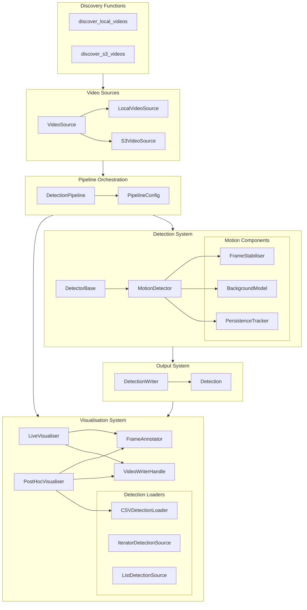
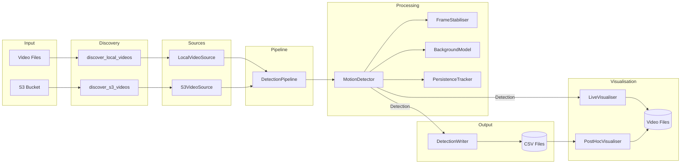
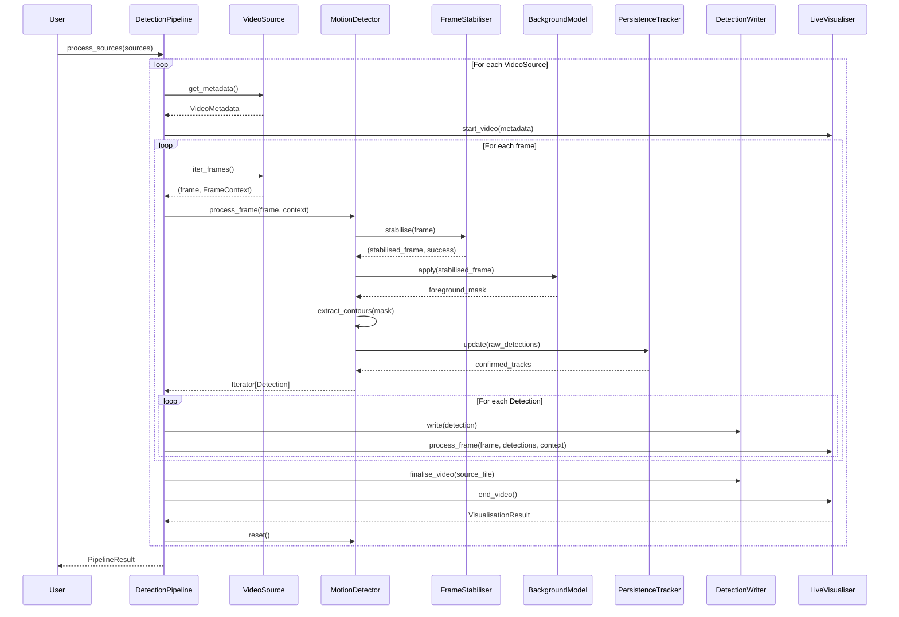
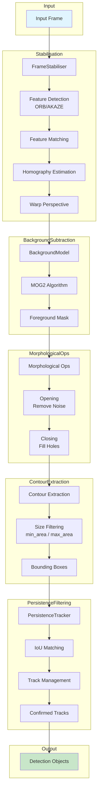
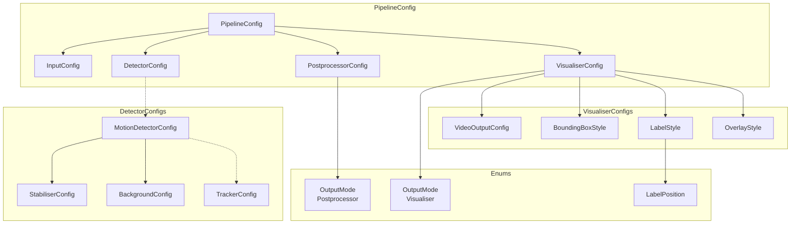
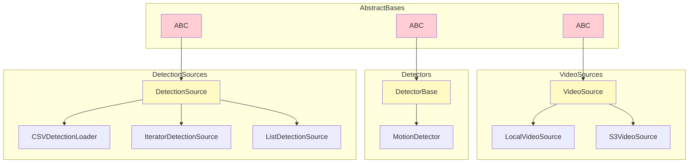

# SeaVision Architecture Diagrams

## Complete Class Diagram

```mermaid
classDiagram
    direction TB

    %% ============================================
    %% VIDEO SOURCES
    %% ============================================
    
    class VideoMetadata {
        +str source_file
        +float fps
        +int frame_count
        +int width
        +int height
        +float duration
    }

    class FrameContext {
        +str source_file
        +int frame_number
        +float timestamp
        +float fps
    }

    class VideoSource {
        <<abstract>>
        +iter_frames()* Iterator~Tuple~
        +get_metadata()* VideoMetadata
        +close() None
    }

    class LocalVideoSource {
        +str filepath
        +get_metadata() VideoMetadata
        +iter_frames() Iterator~Tuple~
        +process_gopro(processed_path, overwrite) None
        +close() None
    }

    class S3VideoSource {
        +str uri
        +str bucket
        +str key
        +int presigned_url_expiry
        +get_metadata() VideoMetadata
        +iter_frames() Iterator~Tuple~
        +close() None
    }

    VideoSource <|-- LocalVideoSource
    VideoSource <|-- S3VideoSource
    VideoSource ..> VideoMetadata : returns
    VideoSource ..> FrameContext : yields with frames

    %% ============================================
    %% DETECTORS
    %% ============================================

    class Detection {
        +str source_file
        +float timestamp
        +int frame_number
        +float xc
        +float yc
        +float width
        +float height
        +Optional~float~ confidence
        +to_csv_row() dict
    }

    class DetectorBase {
        <<abstract>>
        +process_frame(frame, context)* Iterator~Detection~
        +reset() None
    }

    class MotionDetectorConfig {
        +StabiliserConfig stabiliser
        +BackgroundConfig background
        +bool stabilisation_enabled
        +int min_area
        +int max_area
        +int morph_kernel_size
        +int morph_iterations
        +bool persistence_enabled
        +int min_persistence
        +int max_frames_missing
        +float iou_threshold
    }

    class MotionDetector {
        +MotionDetectorConfig config
        +process_frame(frame, context) Iterator~Detection~
        +reset() None
    }

    DetectorBase <|-- MotionDetector
    MotionDetector ..> Detection : yields
    MotionDetector --> MotionDetectorConfig : configured by
    DetectorBase ..> FrameContext : receives

    %% ============================================
    %% MOTION DETECTION COMPONENTS
    %% ============================================

    class StabiliserConfig {
        +str feature_detector
        +int max_features
        +float match_ratio
        +int min_matches
        +float ransac_threshold
    }

    class FrameStabiliser {
        +StabiliserConfig config
        +stabilise(frame) Tuple~ndarray, bool~
        +reset() None
    }

    class BackgroundConfig {
        +int history
        +float var_threshold
        +bool detect_shadows
        +float learning_rate
    }

    class BackgroundModel {
        +BackgroundConfig config
        +apply(frame) ndarray
        +reset() None
    }

    class TrackerConfig {
        +int min_persistence
        +int max_frames_missing
        +float iou_threshold
    }

    class TrackedObject {
        +int track_id
        +float xc
        +float yc
        +float width
        +float height
        +int age
        +int frames_since_update
        +Tuple bbox
        +update(xc, yc, width, height) None
        +mark_missed() None
    }

    class PersistenceTracker {
        +TrackerConfig config
        +update(detections) List~TrackedObject~
        +reset() None
    }

    MotionDetector --> FrameStabiliser : uses
    MotionDetector --> BackgroundModel : uses
    MotionDetector --> PersistenceTracker : uses
    FrameStabiliser --> StabiliserConfig : configured by
    BackgroundModel --> BackgroundConfig : configured by
    PersistenceTracker --> TrackerConfig : configured by
    PersistenceTracker ..> TrackedObject : manages
    MotionDetectorConfig --> StabiliserConfig : contains
    MotionDetectorConfig --> BackgroundConfig : contains

    %% ============================================
    %% POSTPROCESSOR
    %% ============================================

    class OutputMode_Post {
        <<enumeration>>
        SINGLE_FILE
        PER_VIDEO
    }

    class PostprocessorConfig {
        +str output_dir
        +OutputMode output_mode
        +str single_file_name
        +bool overwrite
    }

    class DetectionWriter {
        +PostprocessorConfig config
        +int detection_count
        +write(detection) None
        +write_batch(detections) None
        +finalise_video(source_file) None
        +close() None
    }

    DetectionWriter --> PostprocessorConfig : configured by
    DetectionWriter ..> Detection : writes
    PostprocessorConfig --> OutputMode_Post : uses

    %% ============================================
    %% VISUALISER CONFIGURATION
    %% ============================================

    class OutputMode_Vis {
        <<enumeration>>
        FILE
        STREAM
        BOTH
    }

    class LabelPosition {
        <<enumeration>>
        TOP_LEFT
        TOP_RIGHT
        BOTTOM_LEFT
        BOTTOM_RIGHT
        ABOVE
        BELOW
    }

    class BoundingBoxStyle {
        +bool draw_box
        +Tuple colour
        +int thickness
        +bool draw_centre
        +int centre_radius
        +Tuple centre_colour
    }

    class LabelStyle {
        +bool enabled
        +float font_scale
        +int font_thickness
        +Tuple colour
        +Optional~Tuple~ background_colour
        +LabelPosition position
        +int padding
        +bool show_confidence
        +bool show_frame_number
        +Optional~str~ custom_format
    }

    class OverlayStyle {
        +bool enabled
        +bool show_frame_number
        +bool show_timestamp
        +bool show_detection_count
        +float font_scale
        +int font_thickness
        +Tuple colour
        +Optional~Tuple~ background_colour
        +Tuple position
    }

    class VideoOutputConfig {
        +str output_dir
        +str filename_suffix
        +str codec
        +str format
        +Optional~float~ fps
        +bool overwrite
        +int include_parent_dirs
    }

    class VisualiserConfig {
        +OutputMode output_mode
        +VideoOutputConfig video_output
        +BoundingBoxStyle bbox_style
        +LabelStyle label_style
        +OverlayStyle overlay_style
        +Optional~float~ min_confidence
        +bool only_frames_with_detections
        +int frame_skip
    }

    LabelStyle --> LabelPosition : uses
    VisualiserConfig --> OutputMode_Vis : uses
    VisualiserConfig --> VideoOutputConfig : contains
    VisualiserConfig --> BoundingBoxStyle : contains
    VisualiserConfig --> LabelStyle : contains
    VisualiserConfig --> OverlayStyle : contains

    %% ============================================
    %% VISUALISER COMPONENTS
    %% ============================================

    class FrameAnnotator {
        +annotate_frame(frame, detections, context, copy) ndarray
    }

    class VideoWriterHandle {
        +VideoOutputConfig config
        +VideoMetadata metadata
        +int frame_count
        +Path output_path
        +write(frame) None
        +close() None
    }

    class AnnotatedFrame {
        +ndarray frame
        +int frame_number
        +float timestamp
        +List~Detection~ detections
        +str source_file
    }

    class VisualisationResult {
        +str source_file
        +Optional~str~ output_path
        +int total_frames
        +int frames_with_detections
        +int total_detections
        +summary() str
    }

    FrameAnnotator --> BoundingBoxStyle : uses
    FrameAnnotator --> LabelStyle : uses
    FrameAnnotator --> OverlayStyle : uses
    FrameAnnotator ..> Detection : renders
    VideoWriterHandle --> VideoOutputConfig : configured by
    VideoWriterHandle --> VideoMetadata : uses
    AnnotatedFrame --> Detection : contains

    %% ============================================
    %% VISUALISERS
    %% ============================================

    class LiveVisualiser {
        +start_video(metadata) None
        +process_frame(frame, detections, context) Optional~AnnotatedFrame~
        +end_video() VisualisationResult
    }

    class PostHocVisualiser {
        +visualise(video_source, csv_path) Iterator~AnnotatedFrame~
        +visualise_from_source(video_source, detection_source) Iterator~AnnotatedFrame~
    }

    LiveVisualiser --> VisualiserConfig : configured by
    LiveVisualiser --> FrameAnnotator : uses
    LiveVisualiser --> VideoWriterHandle : uses
    LiveVisualiser ..> AnnotatedFrame : yields
    LiveVisualiser ..> VisualisationResult : returns

    PostHocVisualiser --> VisualiserConfig : configured by
    PostHocVisualiser --> FrameAnnotator : uses
    PostHocVisualiser --> VideoWriterHandle : uses
    PostHocVisualiser ..> AnnotatedFrame : yields

    %% ============================================
    %% DETECTION LOADERS
    %% ============================================

    class DetectionSource {
        <<abstract>>
        +get_detections_for_frame(frame_number)* List~Detection~
        +get_source_file()* str
        +get_frame_numbers_with_detections()* List~int~
        +get_total_detection_count() int
        +get_frame_count_with_detections() int
    }

    class CSVDetectionLoader {
        +Path csv_path
        +List~str~ sources_in_file
        +get_detections_for_frame(frame_number) List~Detection~
        +get_source_file() str
        +get_frame_numbers_with_detections() List~int~
    }

    class FrameDetections {
        +str source_file
        +Dict detections_by_frame
        +get_detections_for_frame(frame_number) List~Detection~
        +get_frame_numbers_with_detections() List~int~
        +add_detection(detection) None
        +get_total_detection_count() int
    }

    class IteratorDetectionSource {
        +get_detections_for_frame(frame_number) List~Detection~
        +get_source_file() str
        +get_frame_numbers_with_detections() List~int~
    }

    class ListDetectionSource {
        +get_detections_for_frame(frame_number) List~Detection~
        +get_source_file() str
        +get_frame_numbers_with_detections() List~int~
    }

    DetectionSource <|-- CSVDetectionLoader
    DetectionSource <|-- IteratorDetectionSource
    DetectionSource <|-- ListDetectionSource
    DetectionSource ..> Detection : provides
    FrameDetections ..> Detection : stores
    PostHocVisualiser --> DetectionSource : uses

    %% ============================================
    %% PIPELINE
    %% ============================================

    class InputConfig {
        +int frame_skip
    }

    class DetectorConfig {
        +str type
        +dict config
    }

    class PipelineConfig {
        +InputConfig input
        +PostprocessorConfig output
        +DetectorConfig detector
        +bool resume
        +Optional~VisualiserConfig~ visualiser
        +from_dict(data)$ PipelineConfig
    }

    class PipelineResult {
        +int videos_processed
        +int videos_skipped
        +int videos_failed
        +int total_detections
        +float elapsed_time
        +Dict detections_per_video
        +Dict failed_videos
        +summary() str
    }

    class DryRunResult {
        +int videos_found
        +int videos_to_process
        +int videos_skipped
        +int total_frames
        +float total_duration
        +str output_mode
        +str output_dir
        +summary() str
    }

    class DetectionPipeline {
        +PipelineConfig config
        +process_sources(sources, dry_run) PipelineResult|DryRunResult
    }

    PipelineConfig --> InputConfig : contains
    PipelineConfig --> PostprocessorConfig : contains
    PipelineConfig --> DetectorConfig : contains
    PipelineConfig --> VisualiserConfig : contains

    DetectionPipeline --> PipelineConfig : configured by
    DetectionPipeline --> VideoSource : processes
    DetectionPipeline --> DetectorBase : uses
    DetectionPipeline --> DetectionWriter : uses
    DetectionPipeline --> LiveVisualiser : optionally uses
    DetectionPipeline ..> PipelineResult : returns
    DetectionPipeline ..> DryRunResult : returns
```

## Simplified Overview Diagram

## Data Flow Diagram

## Pipeline Sequence Diagram

## Motion Detection Pipeline

## Configuration Hierarchy

## Class Inheritance Tree

