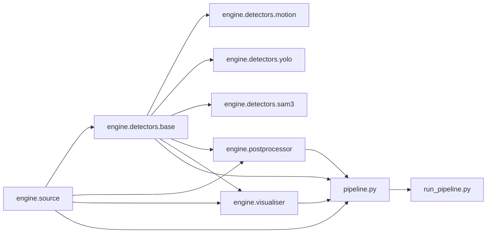
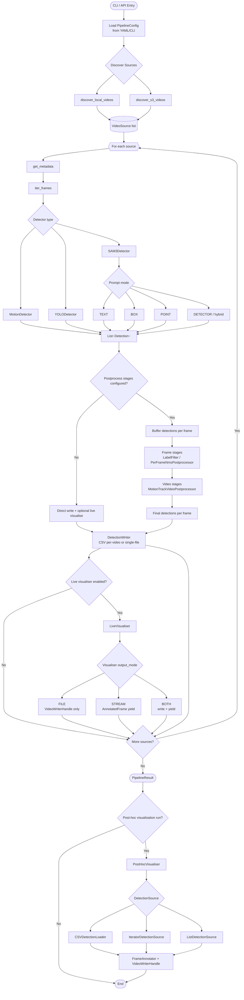
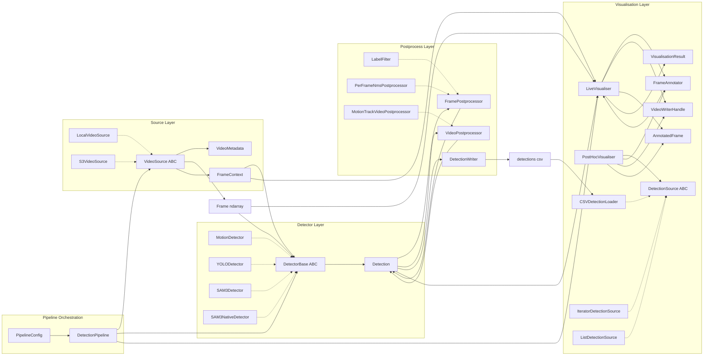

# SeaVision Architecture Diagrams

Updated class diagrams for the current SeaVision package.

---

## 1) Core Class Diagram

```mermaid
classDiagram
    direction TB

    %% =========================
    %% Sources
    %% =========================
    class VideoMetadata {
      +str source_file
      +float fps
      +int frame_count
      +int width
      +int height
      +float duration
    }

    class FrameContext {
      +str source_file
      +int frame_number
      +float timestamp
      +float fps
    }

    class VideoSource {
      <<abstract>>
      +iter_frames()* Iterator[(ndarray, FrameContext)]
      +get_metadata()* VideoMetadata
      +close() None
    }

    class LocalVideoSource {
      +str filepath
      +get_metadata() VideoMetadata
      +iter_frames() Iterator[(ndarray, FrameContext)]
      +process_gopro(processed_path, overwrite) None
      +close() None
    }

    class S3VideoSource {
      +str uri
      +str bucket
      +str key
      +get_metadata() VideoMetadata
      +iter_frames() Iterator[(ndarray, FrameContext)]
      +close() None
    }

    VideoSource <|-- LocalVideoSource
    VideoSource <|-- S3VideoSource
    VideoSource ..> VideoMetadata : returns
    VideoSource ..> FrameContext : yields

    %% =========================
    %% Detector base
    %% =========================
    class Detection {
      +str source_file
      +float timestamp
      +int frame_number
      +float xc
      +float yc
      +float width
      +float height
      +Optional~float~ confidence
      +Optional~str~ label
      +Optional~int~ track_id
      +to_csv_row() dict
      +bbox tuple
      +area float
    }

    class DetectorBase {
      <<abstract>>
      +process_frame(frame, context)* Iterator~Detection~
      +reset() None
    }

    DetectorBase ..> FrameContext : consumes
    DetectorBase ..> Detection : emits

    %% =========================
    %% Motion detector
    %% =========================
    class StabiliserConfig
    class FrameStabiliser {
      +stabilise(frame) Tuple[(ndarray, bool)]
      +reset() None
    }

    class BackgroundConfig
    class BackgroundModel {
      +apply(frame) ndarray
      +reset() None
    }

    class TrackerConfig
    class TrackedObject {
      +int track_id
      +update(xc, yc, width, height) None
      +mark_missed() None
      +bbox tuple
    }

    class PersistenceTracker {
      +update(detections) List~TrackedObject~
      +reset() None
    }

    class MotionDetectorConfig {
      +bool stabilisation_enabled
      +int min_area
      +int max_area
      +bool persistence_enabled
      +int min_persistence
      +int max_frames_missing
      +float iou_threshold
    }

    class MotionDetector {
      +process_frame(frame, context) Iterator~Detection~
      +reset() None
    }

    DetectorBase <|-- MotionDetector
    MotionDetector --> MotionDetectorConfig
    MotionDetector --> FrameStabiliser
    MotionDetector --> BackgroundModel
    MotionDetector --> PersistenceTracker
    FrameStabiliser --> StabiliserConfig
    BackgroundModel --> BackgroundConfig
    PersistenceTracker --> TrackerConfig
    PersistenceTracker --> TrackedObject

    %% =========================
    %% YOLO detector
    %% =========================
    class YOLODetectorConfig {
      +str model_path
      +str device
      +int imgsz
      +float conf_threshold
      +float iou_threshold
      +int max_detections
    }

    class YOLODetector {
      +process_frame(frame, context) Iterator~Detection~
      +reset() None
    }

    DetectorBase <|-- YOLODetector
    YOLODetector --> YOLODetectorConfig

    %% =========================
    %% SAM3 detectors
    %% =========================
    class PromptType {
      <<enumeration>>
      TEXT
      BOX
      POINT
      DETECTOR
    }

    class HybridStrategy {
      <<enumeration>>
      BOX_REFINEMENT
      CLASSIFY_REGIONS
    }

    class PrompterConfig {
      +str detector_type
      +dict detector_config
      +HybridStrategy strategy
      +List~str~ text_prompts
    }

    class PromptConfig {
      +PromptType prompt_type
      +List~str~ text_prompts
      +List~List~float~~ box_prompts
      +List~List~float~~ point_prompts
      +PrompterConfig prompter
      +int reprompt_interval
      +bool reprompt_on_lost
    }

    class SAM3DetectorConfig {
      +str checkpoint
      +str device
      +bool video_mode
      +float confidence_threshold
      +int min_mask_area
      +int max_mask_area
      +bool output_masks
      +bool output_labels
    }

    class SAM3Detector {
      +process_frame(frame, context) Iterator~Detection~
      +add_exemplar(box, point, positive) None
      +clear_exemplars() None
      +reset() None
    }

    class SAM3NativeDetector {
      +process_frame(frame, context) Iterator~Detection~
      +reset() None
    }

    DetectorBase <|-- SAM3Detector
    DetectorBase <|-- SAM3NativeDetector
    SAM3Detector --> SAM3DetectorConfig
    SAM3NativeDetector --> SAM3DetectorConfig
    SAM3DetectorConfig --> PromptConfig
    PromptConfig --> PromptType
    PromptConfig --> PrompterConfig
    PrompterConfig --> HybridStrategy

    %% =========================
    %% Postprocessing / Writer
    %% =========================
    class PostOutputMode {
      <<enumeration>>
      SINGLE_FILE
      PER_VIDEO
    }

    class CSVWriterConfig {
      +str output_dir
      +OutputMode output_mode
      +str single_file_name
      +bool overwrite
    }

    class FramePostprocessor {
      <<protocol>>
      +reset_for_video(metadata)
      +process_frame(detections, context)
      +finalize_video()
    }

    class VideoPostprocessor {
      <<protocol>>
      +process_video(detections_per_frame, metadata, frames, contexts)
    }

    class LabelFilterConfig
    class LabelFilter
    class PerFrameNmsConfig
    class PerFrameNmsPostprocessor
    class MotionTrackVideoConfig
    class MotionTrackVideoPostprocessor

    class PostprocessStage {
      +str kind
      +object impl
    }

    class DetectionWriter {
      +write(detection) None
      +write_batch(detections) None
      +finalise_video(source_file) None
      +close() None
      +int detection_count
    }

    FramePostprocessor <|.. LabelFilter
    FramePostprocessor <|.. PerFrameNmsPostprocessor
    VideoPostprocessor <|.. MotionTrackVideoPostprocessor
    LabelFilter --> LabelFilterConfig
    PerFrameNmsPostprocessor --> PerFrameNmsConfig
    MotionTrackVideoPostprocessor --> MotionTrackVideoConfig
    DetectionWriter --> CSVWriterConfig
    CSVWriterConfig --> PostOutputMode
    DetectionWriter ..> Detection : writes

    %% =========================
    %% Visualiser
    %% =========================
    class VisOutputMode {
      <<enumeration>>
      FILE
      STREAM
      BOTH
    }

    class LabelPosition {
      <<enumeration>>
      TOP_LEFT
      TOP_RIGHT
      BOTTOM_LEFT
      BOTTOM_RIGHT
      ABOVE
      BELOW
    }

    class BoundingBoxStyle
    class LabelStyle
    class OverlayStyle
    class VideoOutputConfig

    class VisualiserConfig {
      +OutputMode output_mode
      +float min_confidence
      +bool only_frames_with_detections
      +int frame_skip
    }

    class FrameAnnotator {
      +annotate_frame(frame, detections, context, copy) ndarray
    }

    class VideoWriterHandle {
      +write(frame) None
      +close() None
      +Path output_path
    }

    class DetectionSource {
      <<abstract>>
      +get_detections_for_frame(frame_number)*
      +get_source_file()*
      +get_frame_numbers_with_detections()*
    }

    class FrameDetections
    class CSVDetectionLoader
    class IteratorDetectionSource
    class ListDetectionSource

    class AnnotatedFrame
    class VisualisationResult {
      +summary() str
    }

    class LiveVisualiser {
      +start_video(metadata) None
      +process_frame(frame, detections, context) Optional~AnnotatedFrame~
      +end_video() VisualisationResult
    }

    class PostHocVisualiser {
      +visualise(video_source, csv_path) Iterator~AnnotatedFrame~
      +visualise_from_source(video_source, detection_source) Iterator~AnnotatedFrame~
    }

    VisualiserConfig --> VisOutputMode
    LabelStyle --> LabelPosition
    VisualiserConfig --> VideoOutputConfig
    VisualiserConfig --> BoundingBoxStyle
    VisualiserConfig --> LabelStyle
    VisualiserConfig --> OverlayStyle

    DetectionSource <|-- CSVDetectionLoader
    DetectionSource <|-- IteratorDetectionSource
    DetectionSource <|-- ListDetectionSource
    FrameDetections ..> Detection

    FrameAnnotator ..> Detection
    VideoWriterHandle --> VideoOutputConfig
    VideoWriterHandle --> VideoMetadata

    LiveVisualiser --> VisualiserConfig
    LiveVisualiser --> FrameAnnotator
    LiveVisualiser --> VideoWriterHandle
    LiveVisualiser ..> AnnotatedFrame
    LiveVisualiser ..> VisualisationResult

    PostHocVisualiser --> VisualiserConfig
    PostHocVisualiser --> FrameAnnotator
    PostHocVisualiser --> VideoWriterHandle
    PostHocVisualiser --> DetectionSource
    PostHocVisualiser ..> AnnotatedFrame

    %% =========================
    %% Pipeline
    %% =========================
    class InputConfig {
      +int frame_skip
    }

    class DetectorConfig {
      +str type
      +dict config
    }

    class PipelineConfig {
      +InputConfig input
      +CSVWriterConfig output
      +DetectorConfig detector
      +bool resume
      +VisualiserConfig visualiser
      +dict postprocess
      +from_dict(data) PipelineConfig
    }

    class DryRunResult {
      +summary() str
    }

    class PipelineResult {
      +summary() str
    }

    class DetectionPipeline {
      +process_sources(sources, dry_run) Union~PipelineResult, DryRunResult~
    }

    DetectionPipeline --> PipelineConfig
    DetectionPipeline --> DetectionWriter
    DetectionPipeline --> DetectorBase
    DetectionPipeline --> LiveVisualiser
    DetectionPipeline --> PostprocessStage
    DetectionPipeline ..> DryRunResult
    DetectionPipeline ..> PipelineResult
```

---

## 2) Module Dependency Diagram

---

## 3) Pipeline Flow Diagram (Runtime + Options)

---

## 4) Compact Horizontal Pipeline Diagram

